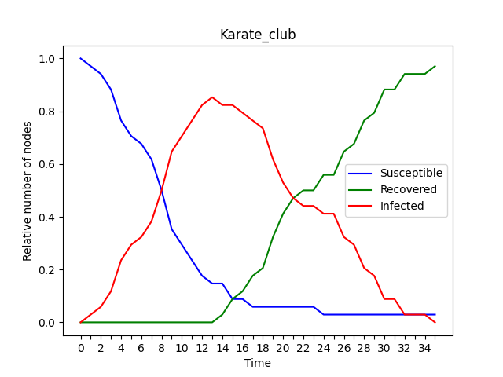

 <h1> Network Analysis: Assignment 3 </h1> 

 
<h5 style="text-align: right">Simone Campisi s4341240 </h5>
<h5 style="text-align: right">Jacopo Dapueto s4345255 </h5>

  
In this assignment we have mapped the **SIR model** into a network. First, the SIR model has been applied to a small network, *Karate Club Graph*, then, it is applied with a large network,*Facebook Circles*, that is the one of the other assignments.
The SIR model simplify the mathematical modeling of infectious diseases. We have 3 different states:

- **Susceptible (S)**. The healthy individuals, who have not yet contacted the virus.
- **Infectious (I)**. Contagious individuals who have contacted the virus and hence they can infects other individuals.
- **Recovered (R)**. Individuals who have recovered from the disease, not more infectious.

In this model there are several parameters:

- The **disease transmission probability p**, which defines the probability of an individual being infected.
- , which represent minimum amount of time steps, of an individual, in the state **I ( infectious)**. After these time steps, an Individual could pass from the state I to the state R (recovered) with a certain probability .
- The number of individual, which are infected at the beginning,  .

### Karate Club Graph

Tante cose belle

<figure align=center>
    
    <figcaption> <i> Figure 1 - Karate Club Graph </i> </figcaption>
</figure>

Altre cose belle

<figure align=center>
    </img>
    <figcaption> <i> Figure 2 - Karate Club Graph, spread epidemics animation - SIR model </i> </figcaption>
</figure>

### Facebook Circles

We performed some experiments changing the parameter of the SIR model:

- **R = 1**

<figure align=center>
    
</figure>

- **R > 1**

<figure align=center>
    
</figure>

- **R < 1**

<figure align=center>
    

</figure>

