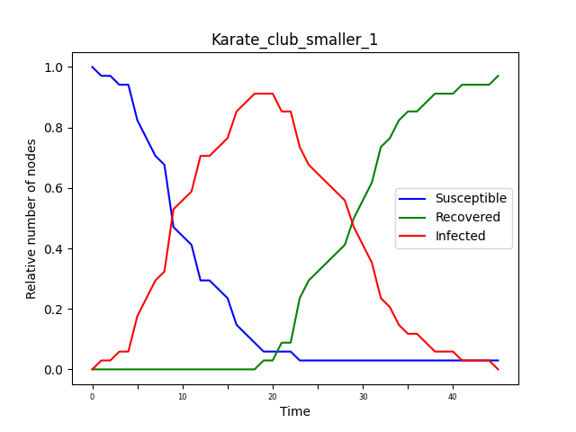
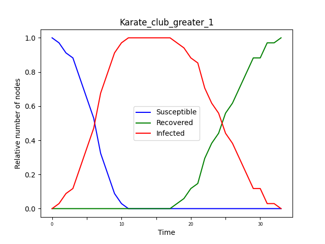
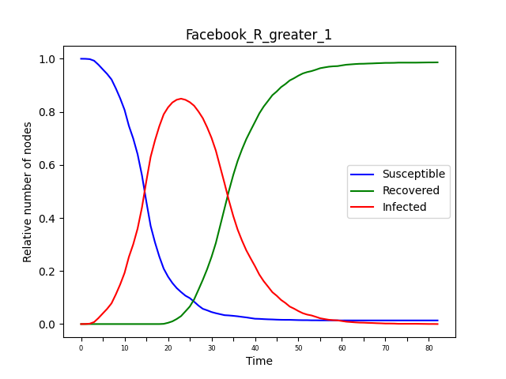

 <h1> Network Analysis: Assignment 3 </h1> 

 
<h5 style="text-align: right">Simone Campisi s4341240 </h5>
<h5 style="text-align: right">Jacopo Dapueto s4345255 </h5>

  
In this assignment we implemented the **SIR epidemic model** and simulated on different networks: *The Karate Club Graph* and *Facebook dataset* already used in the last assignment.
The SIR model simplify the mathematical modeling of infectious diseases by identifying 3 different states that a node:

- **Susceptible (S)**. The healthy individuals, who have not yet contacted the virus.
- **Infectious (I)**. Contagious individuals who have contacted the virus and hence they can infects other individuals.
- **Recovered (R)**. Individuals who have recovered from the disease, not more infectious.

In this model there are several parameters:

- The **disease transmission probability p**, which defines the probability of an individual (in state *S*) being infected if it is neighbors of an node in state I.
-  represents the minimum number of time steps that an individual in the state *I ( infectious)*. And after an Individual can move from the state *I* to the state *R (recovered)* with a certain probability . The probability  is also a parameter.
- The number of individual infected at the beginning of the simulation,  .

All the nodes are initialized to *S* and the first   nodes are infected. the simulation is executed until there is at least one infected node.
For each healty neighbor of an infected node a number is sampled randomically and if the result is less than *p*, the contagion occurs and the neighbor is moved from the state *S* to *I*. 
If the time  for an infected nodehas elapsed, it is moved from the state *I* to *R* with probability *q* in the same way a node move from *S* to *I*.

Hence, we have plotted the model with the two types of network, testing different parameters, in order to observe the different behaviors of the model. Therefore, we plotted a graph showing the evolution of the relative number of nodes in the three states S,I,R, for each time step.
For the smaller network ( Karate Club ), we have build also a gif, which shows the evolution of the spread epidemic.

Since we are not domain experts we decided to perform three experiments for each network according to the value of **R** (expected number of nodes infected at each wave by an infected):
- *R < 1*, less than one node will be infected at each wave and so the disease dies out after a finite number of waves.
- *R = 1* At each wave one infected node will infect exactly one Susceptible node.
- *R > 1* the disease persists by infecting at least one person in each wave.

The value of *R * is given by * k x p* where *k* is the number of expected edges that a node have and *p* is the probability of being infected. The value of *R* remain constant during the simulation.

We decide to infect only one person at the time *zero* ().
As minimum number of waves that a node should stay in the compartment *I* is always *15*, this value is greater enough that a node should infect a reasonable number of the neighbors.

In the following linecharts and animations, the three states are mapped into 3 different colors:
- State *S* is *blue*
- State *I* is *red*
- State *R* is *green*

### Karate Club Graph

As already mentioned, the first network used to test the SIR model is the Karate Club graph. The model has been created with the disease transmission probability *p=0.1*, a minimum amount of time steps for the infected individuals , the transition probability ( from I to R ) *q=0.2*, and only 1 infected individual at the beginning, .

The graph below shows the evolution of the fraction of nodes in S, I, R. As can be seen, the number of susceptible individuals decreases rapidly, and then there is an equally rapid growth in the number of infected individuals. The curve of infected individuals, therefore, grows until it reaches a maximum peak, after which the number of infected individuals begins to decrease until it disappears. The moment this decrease begins, the number begins to increase rapidly until it reaches the total number of individuals.

This is because the infected individuals gradually recover from the virus, and thus will no longer be infected. The algorithm ends when all individuals are in the R state, and thus the virus has been eradicated.
The graphic and the animation below show how the state of the nodes changes during the execution of the SIR model.
<table><tr>
<td>   </td>
<td>  </td>
</tr></table>

  

As said before, we simulate the model considering the 3 different values of R, the parameters of the experiments are the following:

| *R*   | *< K >*   |  *p*       |  *q*  | *i0*  | *T0*  |
|  ---  |    ---    |  ---       |  ---  |  ---  |  ---  |
| 0.45  |   4.58    | 0.015      |  0.2  |  1    |  15   |
|  1    |   4.58    | 1 / *< K >*|  0.2  |  1    |  15   |
| 1.376 |   4.58    |  0.05      |  0.2  |  1    |  15   |

- . This is the best case for an epidemiological point of view: the disease dies out faster because each infected node infects less than one node at each wave. The linecharts below shows that the epidemic reaches the peak ( more or less the 90% of the population ) after 20 time steps the curve of the infected nodes starts immediately to decrease untill no one is sick anymore, this happens at the time steps 45 because the nodes remains infected for at least 15 steps and also the probability *q* is very low. In this regime the epidemic is contained.

<table><tr>
<td>   </td>
<td>  </td>
</tr></table>

- . This is the *endemic* regime, where, respect to the previous case, there is a fester increase of infections at the beginning, reaching quickly the 100% of individuals infected, because everyone infect one people. Respect to the previous case, the number of total infected remains at its maximum remains stable for some time steps and and doesn't immediately start to decrease.
  

<table><tr>
<td>   </td>
<td>  </td>
</tr></table>

- &space;1}" title="\mathbf{R_0 > 1}" />. This is the *epidemic* regime, and it is the worst case. Here every one infects more than one people. For this reason, we have a exponential growth, rapidly leading to the entire population becoming infected. All the population remain infected for a large amount of time steps, then the curve starts the degrowth.

<table><tr>
<td>   </td>
<td>  </td>
</tr></table>

Looking at the three previous graphics, in the first experiment, R < 1, in order to reach the convergence of the algorithm (all the nodes in the the state *R*), were necessary run it for 45 time steps. It is the slowest case, in fact, the other cases R = 1 and R > 1, require less time steps to reach the convergence criterion, since, require less time to achieve the maximum number of the contagions ( respectively 35 and 33 time steps), and also less time in reaching all the individuals in the state *R*. So, the larger the value of R is, the faster the curve of contagions grows, infecting more people

### Facebook Circles

The model has been tested  the real network, Facebook Circles, repeating also the experiments performed with the smaller one.
Also for this network we have repeated the experiments testing the model in the 3 different cases, R < 1, R = 1, R > 1. The parameters chosen are similar to the one used for the Karate Club, in fact, are all the same except for the parameter *p*, which choice depends on *k* being much larger. The parameters are reported in the following table:

| *R*   |  *< K >*  |  *p*       |  *q*  | *i0*  | *T0*  |
|  ---  |    ---    |  ---       |  ---  |  ---  |  ---  |
| 0.655 |   43.69   |  0.015     |  0.2  |   1   |  15   |
|  1    |   43.69   | 1 / *< K >*|  0.2  |   1   |  15   |
| 2.184 |   43.69   |  0.05      |  0.2  |   1   |  15   |

 

- .In this case we have a not too fast growth of infections, and here we have at maximum the 60% of population infected, and after this peak the number of infections decreases rapidly, so, as in the case of the Karate club, with *R < 1* the spread epidemic is contained.

<table><tr>
<td>   </td>
<td>  </td>
</tr></table>

- . Here, the growth of the contagion curve is a little faster than in the previous case, and reaches its peak, more or less, at 65% of the population.

<table><tr>
<td>   </td>
<td>  </td>
</tr></table>

- &space;1}" title="\mathbf{R > 1}" />. As in the case of the Karate Club network, this is the worst situation. In fact, observing the graphic, you can notice that the growth of the infected individuals is much faster than the previous case, reaching in few time steps, the 80% of the population infected. Also here, after the peak of the contagions the curve starts the decrease, with a consequent increase of the recovered individuals.

<table><tr>
<td>   </td>
<td>  </td>
</tr></table>

Comparing these experiments with the previous of the Karate Club network, we can say that the trend of the curves, for the 3 R cases, is quite similar. Also here the number of iterations required in reaching the convergence, decrease with higher R. A clearly visible fact, is that, different network structures can be more or less conductive to the spread of a diseases. In fact, in the case of Karate Club, even with R < 1, the peak of the contagions is reached with the 90% of the population infected, and with R = 1, all the population meet the disease. Instead, with the bigger network, with R < 1, and R = 1, it is reached respectively the 60% and the 65% of the population infected. Hence, this shows how a different network structure greatly affects how, and how much, the disease is spread among people.
Also in the worst case, R > 1, with a R large enough ( more or less 2.1 ), we have a fast increase of the contagions, reaching quickly the peak, but the disease does not succeed in affecting the entire population, arriving to infect, at most, just over 80% of the population, and also this fact is due to the network structure.
